# Echoes of the Hearth

A co-op survival RPG in an isometric 2D world, played in the browser. Gather, build and
survive the Blight across four island biomes, then light the four Monoliths and hold the
World Engine through the final assault. See [PLAN.md](PLAN.md) for the full design.

<p align="center">
  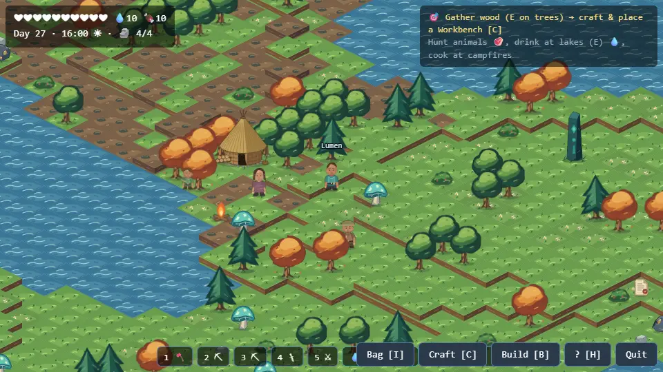
</p>

<p align="center">
  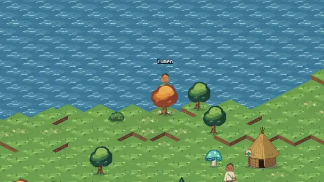
  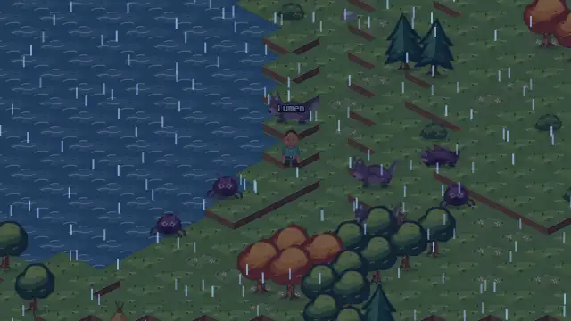
</p>

> All images and clips are real gameplay. Animated previews play inline; every clip also
> has a full **▶ MP4** recording linked below it. They're generated by
> [`tools/media/capture.mjs`](tools/media/capture.mjs) — see [docs/media](docs/media/README.md).

> ## 🤖 AI agents — start here, before anything else
>
> 1. **[`.agents/README.md`](.agents/README.md)** — how agents coordinate on this project: read
>    order, file-ownership rules for parallel work, the mandatory verification gate, and the
>    hard-won pitfalls list.
> 2. **[`.agents/PROJECT_STATE.md`](.agents/PROJECT_STATE.md)** — what is built, what is
>    deliberately deferred, known gaps, and what to work on next. Status source of truth.
> 3. **[`.agents/session-context-dump/`](.agents/session-context-dump/)** — dated knowledge dumps
>    from previous sessions. Read the newest one; it records decisions and root causes you must not
>    re-derive.
> 4. **[AGENT_GUIDE.html](AGENT_GUIDE.html)** — deep technical reference: architecture, protocol,
>    balance tables, workflows.
>
> **Before the owner runs `/clear`, write a session dump** to `.agents/session-context-dump/` using
> the template in `.agents/README.md`, and update `.agents/PROJECT_STATE.md` in the same pass.
>
> **Nothing is done until `npx tsc --noEmit`, `npx vite build`, and `node test.mjs` all pass.**
> esbuild does not type-check — `tsc` is the only gate.

## Contents

- [Run it](#run-it)
- [Controls](#controls)
- [The world](#the-world)
- [Living off the land](#living-off-the-land)
- [Building](#building)
- [Creatures](#creatures)
- [The island folk](#the-island-folk)
- [Progression](#progression)
- [How it's built](#how-its-built)

## Run it

```bash
npm install
npm start          # control plane :8090 + Go game server :8082 + client :5173
npm run start:dev  # same, with the dev tester (F9 kit, F10 panel) for loopback clients
```

Open <http://localhost:5173>, set a name, and pick **Play solo / default world** — or
create a room and share its code. Open several tabs or browsers for local co-op. For LAN
play, friends open `http://<your-ip>:5173`; allow Node.js and the game server through
Windows Firewall (ports 5173, 8090, 8082) the first time.

`npm start` needs [Go](https://go.dev/dl/) (the game server runs with `go run`). The old
Node server is still available as `npm run start:legacy` (port 8081).

## Controls

| Key | Action |
| --- | --- |
| **WASD / arrows** | move (mud slows you 50%; deep water means swimming) |
| **E** | gather, pick up, talk to folk, trade with a medic, plant / harvest, use a mineshaft or Monolith Core |
| **F** | attack (turns to face the nearest enemy) |
| **SPACE** | jump — standing and running jumps differ; jumping clears higher ledges |
| **1–5** | equip axe, pickaxe, stone pickaxe, stone sword, iron sword |
| **C / B / I / H** | craft · build · inventory · help |
| **R** | rotate a placeable before confirming · **ESC** cancels |
| **T** | plant a torch (mines only; 2 wood + 1 fiber) |
| **M** | mute / unmute |
| **F9 / F10** | dev kit / dev panel (`npm run start:dev`) |

## The world

A 1280×1280 map of four major islands around the Core Void, linked by islets. Each
island has its own ground, wildlife, weather and dangers.

<table>
  <tr>
    <td width="50%">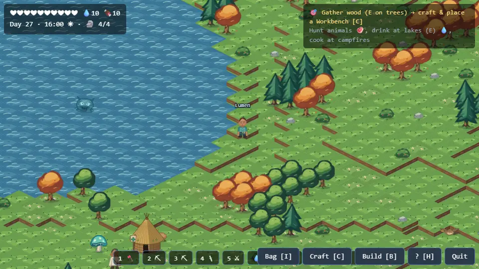<br><b>Whispering Woods</b> — grass and forest, deer and boar, rain. Where every keeper starts.</td>
    <td width="50%">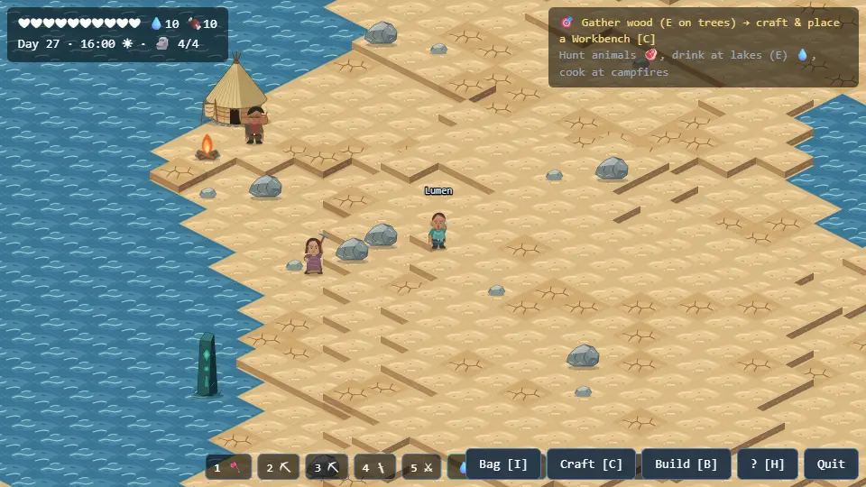<br><b>Sinking Dunes</b> — sand and boulders, lizards and crabs. Day heat burns without a Heat Cloak; sandstorms roll in.</td>
  </tr>
  <tr>
    <td>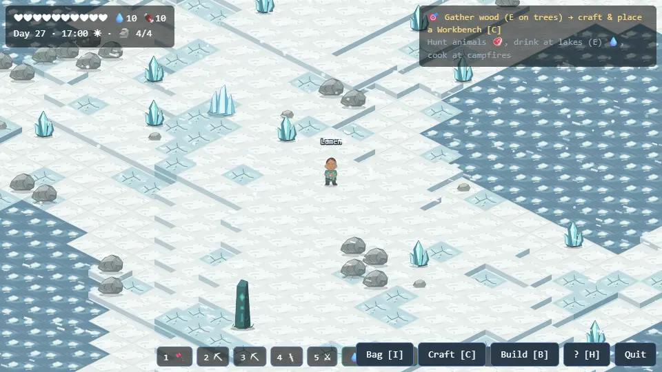<br><b>Frozen Spire</b> — snow, ice and crystal, foxes and hares. The cold bites without a Fur Cloak; blizzards drive you to a campfire.</td>
    <td>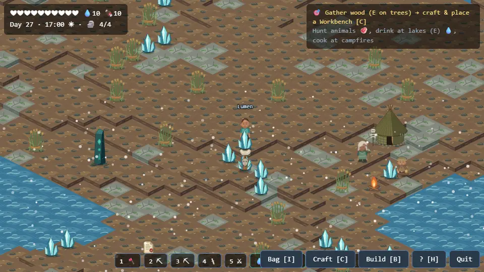<br><b>Sable Marsh</b> — mud and reeds, toads, Elder Yvenne's camp. Bog Shamblers rise from the mire.</td>
  </tr>
</table>

**Day and night.** Days are for gathering; nights belong to the Blight. More creatures
spawn after dark, Stalkers and Frost Wraiths come out, and Blight Storms erode wooden
buildings that aren't near a campfire.

<p align="center">
  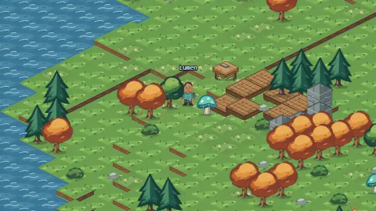<br>
  <a href="docs/media/daynight.mp4">▶ MP4</a> — dusk falls over a small camp
</p>

**Weather** is local to each island:

<table>
  <tr>
    <td width="33%">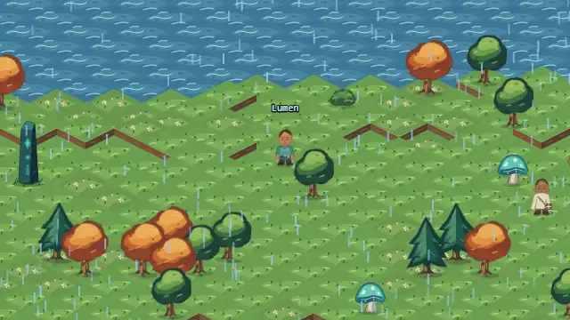<br>Rain — Woods and Marsh · <a href="docs/media/rain.mp4">▶ MP4</a></td>
    <td width="33%">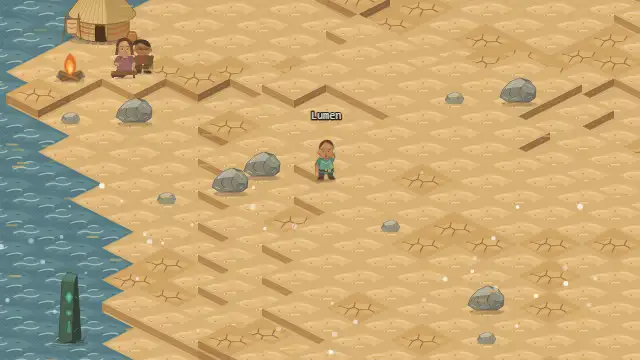<br>Sandstorm — shelter beside a structure · <a href="docs/media/sandstorm.mp4">▶ MP4</a></td>
    <td width="33%">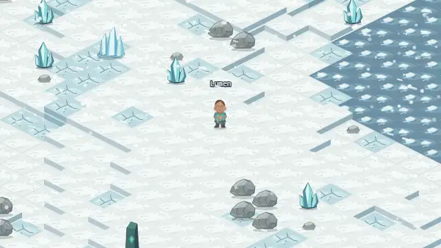<br>Blizzard — reach a campfire · <a href="docs/media/blizzard.mp4">▶ MP4</a></td>
  </tr>
</table>

**Terrain.** Several elevation levels: you can always drop down a cliff (a 2+ level drop
hurts), but climbing more than one level needs a jump. Water can be swum, slowly — or
crossed by boat or by bridge. Some seas are freezing or scalding.

## Living off the land

<table>
  <tr>
    <td width="50%">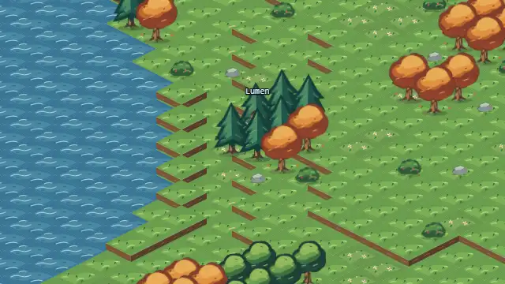<br><b>Gathering</b> — chop trees, pick bushes, mine stone, boulders and crystal. Resources pop out and fly to you. Over-log a sector and its soil sours to mud. · <a href="docs/media/gather.mp4">▶ MP4</a></td>
    <td width="50%">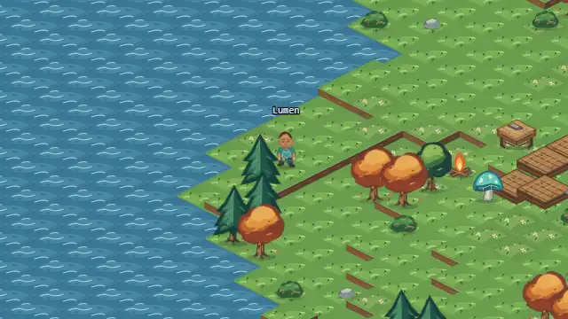<br><b>Swimming</b> — slow and exposed, but you can still fight. Craft a boat for safe crossings. · <a href="docs/media/swim.mp4">▶ MP4</a></td>
  </tr>
</table>

- **Hunger and thirst** drain over time: hunt animals (bigger ones drop more meat), cook
  at a campfire, drink at lakes. Campfires also heal you.
- **Farming** — till a farm plot and plant **wheat** (2 fiber, ~6 min, 3 grain) or
  **glowcap** (1 essence, ~9 min, 2 glowcap). Crops show as sprouts, then half-grown,
  then ripe.
- **The mines** — build a mineshaft and press E to go down. Dig tunnels, plant torches
  and furnish them: keepers have no houses, so the mines are the safe place — no weather,
  no creatures, and the only place furniture stands.

<p align="center">
  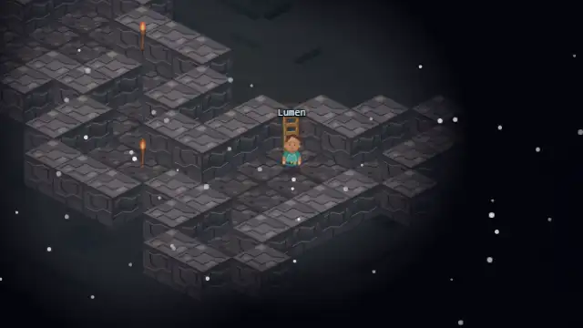<br>
  <a href="docs/media/mines.mp4">▶ MP4</a> — down the shaft, planting a torch
</p>

**Gear.** Tools and weapons are crafted at the workbench and forge. A Heat Cloak and a Fur
Cloak make the Dunes and the Spire survivable, and **Starmetal Armor** — a deliberately
late, expensive forge piece — halves the damage creatures deal. Each keeper wears their
own shirt colour, with any cloak or armor drawn on.

## Building

Place legacy structures (workbench, campfire, forge, mineshaft, fences…) or build
modularly, piece by piece: floors, walls, doors, pillars, fixtures, decor and **bridges**
over water. Walls block creatures; creatures smash them down.

<p align="center">
  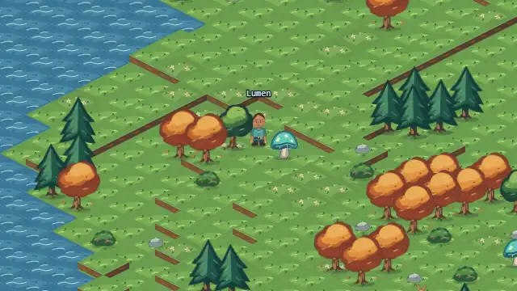<br>
  <a href="docs/media/build.mp4">▶ MP4</a> — a wooden floor, stone walls, a campfire and a workbench
</p>

Nothing regrows through what you build: a felled tree waits until its tile is clear
again, and you can't lay a floor over a standing tree or rock.

## Creatures

<p align="center">
  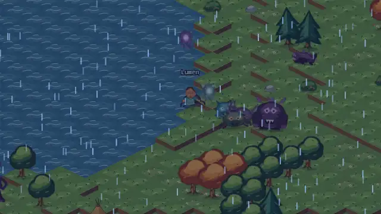<br>
  <a href="docs/media/enemies.mp4">▶ MP4</a> — the Blight's whole roster at dusk
</p>

| Creature | Where / when | What it does |
| --- | --- | --- |
| **Crawler** | everywhere, bred on corrupted ground | swarms; fears firelight at night |
| **Stalker** | night | circles, darts in, strikes and falls back; can swim |
| **Husk Wolf** | Woods, night, in packs | the pack spreads out and comes from several sides |
| **Brute** | once 2 Monoliths are awake | besieges structures; heavy telegraphed stomp; bolts keepers who hide in water |
| **Blight Wisp** | drifting | corrupts the ground it passes over |
| **Bog Shambler** | Marsh | heavy, ignores walls, corrupts the ground when it dies |
| **Frost Wraith** | Spire, night | charges fast; its touch slows you |
| **Drowned** | rises from the shallows near keepers | amphibious skirmisher |
| **Blight Lancer** | once a Monolith is awake | slow siege caster; keeps its distance and beams structures |

**How they hunt.** Creatures walk and sprint with real gaits. They path around walls
and lakes and only chew through a base that's fully walled in. They remember where you
were and search for you, rouse their neighbours when struck, and lead a moving target.
Wounded skirmishers break off. Crawlers and wolves won't come close to a campfire at
night. They cross keepers' **bridges** too — and cutting a bridge leaves whatever was on
it floundering in the water.

<p align="center">
  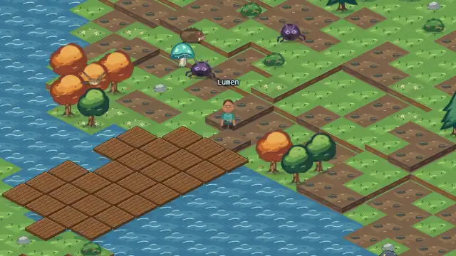<br>
  <a href="docs/media/bridge-chase.mp4">▶ MP4</a> — crawlers follow a keeper over a bridge
</p>

## The island folk

Three islands have camps of non-player folk: the Hearthfolk in the Woods, an Ashmark
hunter's lodge on the Dunes, and Elder Yvenne's camp in the Marsh. They wander, work,
sit by the fire and stop to talk when you walk up (press **E** for more). When creatures
come near, they shout and run for their hut, and come back out once it's safe. At night
everyone turns in except the camp's watcher.

<p align="center">
  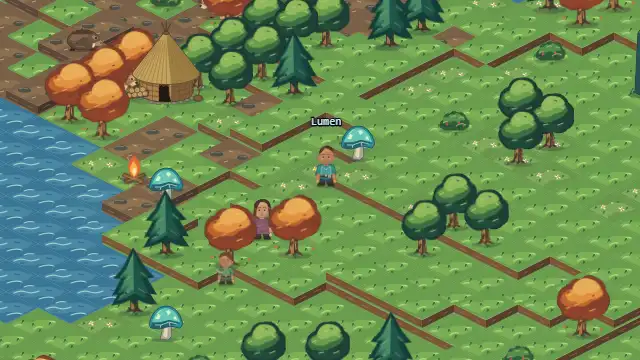<br>
  <a href="docs/media/camp.mp4">▶ MP4</a> — a villager stops to talk, then crawlers send the camp running
</p>

Two **medics** — in the Woods and on the Spire — heal you to full for a resource
bargain, as long as you're out of combat.

<p align="center">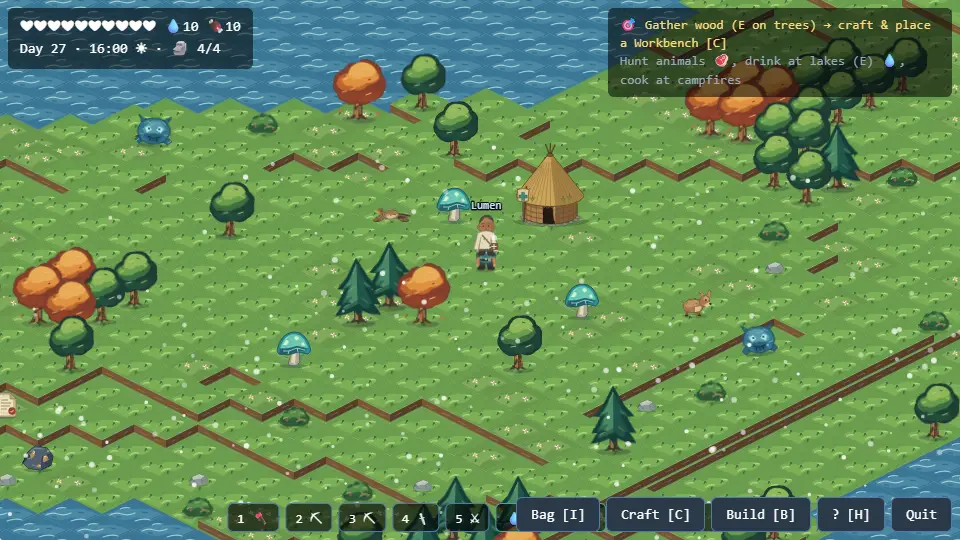</p>

## Progression

1. **Whispering Woods** — chop trees, place a Workbench, craft an axe and pickaxe, place a
   Campfire (it heals you and shields wooden buildings from the nightly Blight Storm).
2. **Sinking Dunes** — survive the heat with a **Heat Cloak**; mine boulders.
3. **Frozen Spire** — survive the cold with a **Fur Cloak**; mine **Crystal** with a Stone
   Pickaxe.
4. Build the **Aether Forge** → forge **Monolith Cores** (crystal + Blight Essence from
   creatures) → awaken all **4 Monoliths** → build the **World Engine** at the Core Void
   centre → survive the 4-minute final assault. Every Monolith you awaken makes the Blight
   stronger.

## How it's built

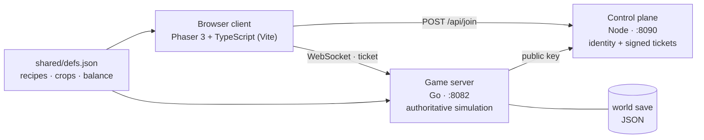

- **Client** (`src/`) — Phaser 3 + TypeScript. Renders the streamed world, predicts your own
  movement, and animates everything: the keeper rig, creature gaits, the folk.
- **Game server** (`gameserver/`) — Go, authoritative for the whole world at 5 ticks/s:
  movement validation, combat, creature AI, folk, weather, farming, building. Streams the
  map to clients in 64×64 chunks.
- **Control plane** (`control/`) — Node; issues signed join tickets and the dev claim.
- **Shared rules** (`shared/defs.json`) — single source of truth for recipes, structures,
  crops and balance; `npm run defs` regenerates `shared/defs.js`.

| Doc | What's in it |
| --- | --- |
| [docs/10_GO_WIRE_PROTOCOL.md](docs/10_GO_WIRE_PROTOCOL.md) | every client ↔ server message, the creature AI and folk (§13) |
| [docs/MANIFEST.md](docs/MANIFEST.md) | asset manifest |
| [docs/ASSET_PLACEMENT_GUIDE.md](docs/ASSET_PLACEMENT_GUIDE.md) | which art belongs where |
| [AGENT_GUIDE.html](AGENT_GUIDE.html) | deep technical reference |

**Checks** — the verification gate:

```bash
npx tsc --noEmit                   # the only type check (esbuild doesn't type-check)
npx vite build
cd gameserver && go test ./...     # server rules, AI, folk, bridges, persistence
npm run stack:servers              # then, in another terminal:
npm run test:go                    # end-to-end wire tests against the running servers
```
